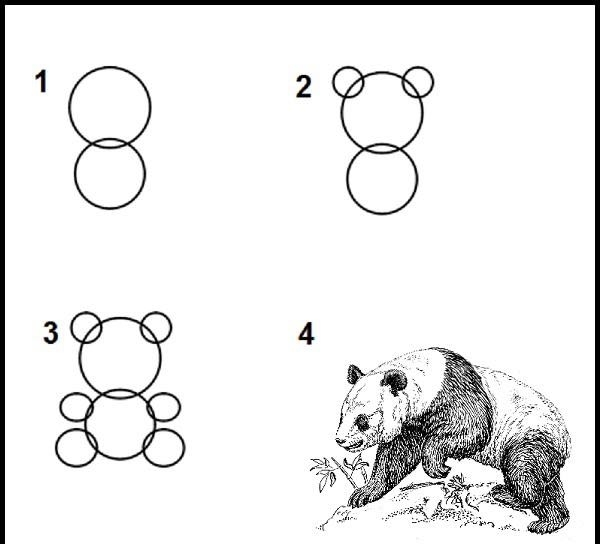

it is not easy
---

---
## if

    If you eat your meal, you can have icecream for desert.

doesnt seem difficult, and it translates to something like

    if (daughter eats her meal)
        she can have icecream
    else
        no icecream
    end

## loops

    you can not play outside, until you finish your homework

same as

    until homework finished
        no play
    end
    let her play outside

or

    while not (homework finished)
        no play
    end
    let her play outside

## variables

    lets flip a coin to decide which pizza to order, heads is dominos and tails is newyorkpizza

variables are simply placeholders, their name is irrelevant, we only care about their value

    order_from = dont know yet
    coin_result = flip coin
    if (coin_result == heads)
        order_from = dominos
    else
        order_from = newyorkpizza
    end

in this example we used 2 variables `order_from` and `coin_result`, in coin_result we simply hold the vaule of the actual coin flip

## variables with loops

now this is very of cool

    with this shampoo you have to wash your hair 5 times, each time put shamoo, wait 3 minutes and rince

so using variables and loops we can do

    number_of_times = 0
    while number_of_times < 5
        put shampoo
        wait 3 minutes
        number_of_times = number_of_times + 1
    end

## goto

## functions

## recursion

## arrays

## maps
